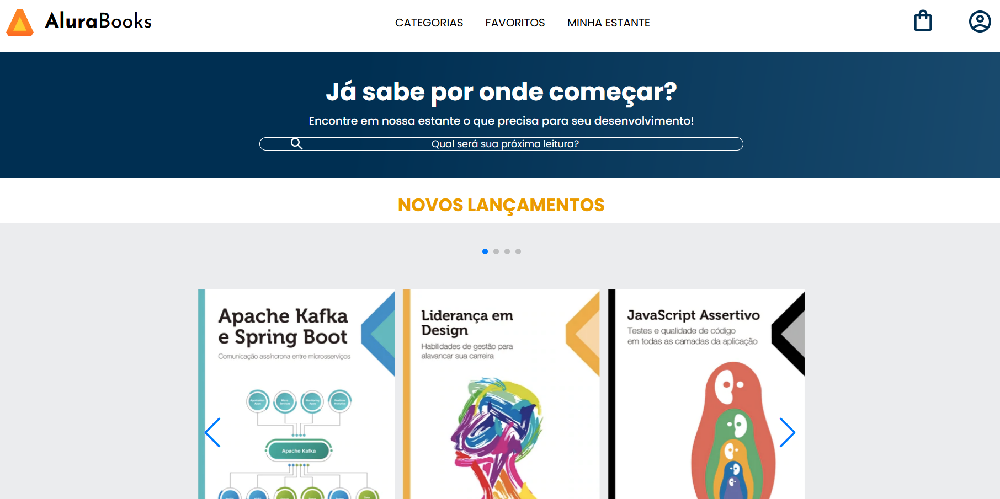
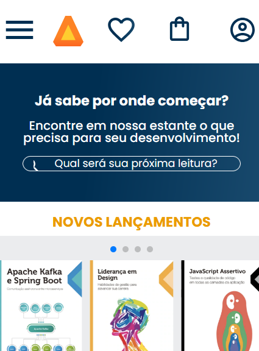

## 📚 Alura Books

O **Alura Books** é uma página construída com a abordagem **mobile-first**, apresentando livros vendidos na Alura. O site exibe seções como lançamentos, mais vendidos e outras categorias de forma responsiva e acessível. O layout foi implementado com base em um protótipo do Figma, explorando a construção de interfaces modernas com HTML e CSS.

 

## 🚀 Sobre o Projeto

Este projeto foi desenvolvido durante o curso da Alura:

* "HTML e CSS: responsividade com mobile-first"

O objetivo foi criar uma interface web adaptável a diversos tamanhos de tela, utilizando técnicas de **media queries** e seguindo uma estrutura semântica. O foco está na organização do conteúdo e na apresentação responsiva, priorizando dispositivos móveis e mantendo boa usabilidade em telas maiores.

## 📚 Objetivos do Curso

* Construir um site com HTML e CSS;
* Entender como interpretar um protótipo de site criado no Figma;
* Conhecer a abordagem **mobile-first**;
* Aprender a utilizar **media queries** na construção de layouts responsivos;
* Realizar o deploy de um site através do Github Pages;
* Compartilhar o aprendizado nas redes sociais.

## 🛠️ Tecnologias Utilizadas

## 🖼️ Visualização do Projeto

Uma prévia das principais funcionalidades do **Alura Books**:

**🌐 Acesse o Projeto Online**

O projeto está disponível para visualização na **Vercel**. Clique no link abaixo para acessar:

**🧾 Página Inicial**

Página destacando os livros disponíveis, com seções como "Lançamentos" e "Mais vendidos".

**📱 Responsividade**

Layout adaptado para diferentes tamanhos de tela com foco em mobile-first.

